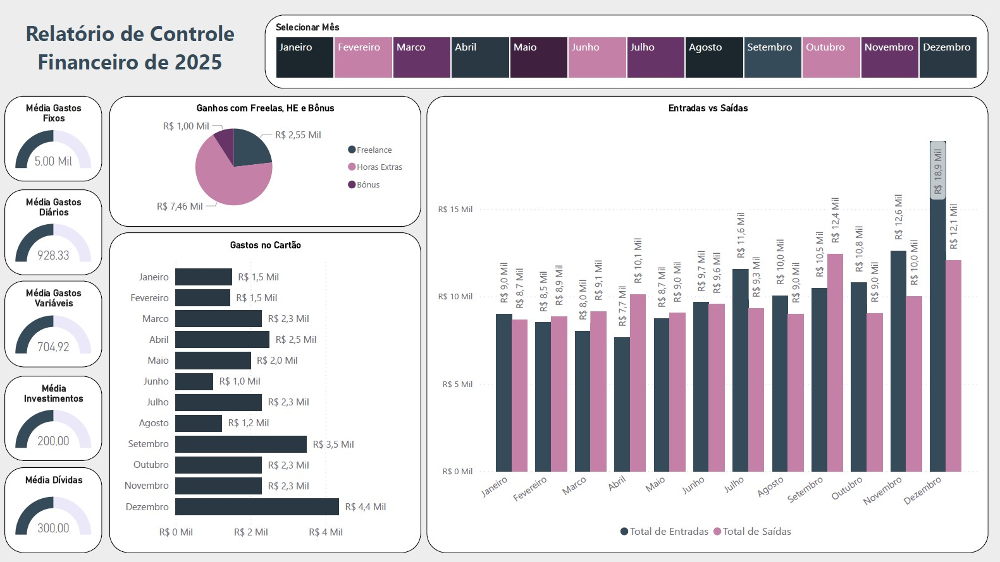

# 📊 Controle Financeiro Anual — Power BI Dashboard

## 📌 Visão Geral
Dashboard de **Controle Financeiro Anual**, desenvolvido no **Power BI Desktop**, com foco em consolidar informações financeiras e gerar insights claros para tomada de decisão.

Projeto criado para fins de **estudo e portfólio**, simulando um cenário real de acompanhamento financeiro pessoal ao longo de um ano.

---

## 🎯 Objetivo do Projeto
- Acompanhar entradas e saídas financeiras mensais  
- Analisar a composição da renda  
- Controlar gastos no cartão de crédito  
- Monitorar médias de gastos e investimentos  
- Facilitar a visualização da saúde financeira ao longo do tempo  

---

## 🗄️ Modelagem de Dados & Banco de Dados (SQL)

Os dados utilizados neste projeto foram estruturados a partir de um modelo relacional simples, simulando um controle financeiro anual.

Abaixo está o **script SQL utilizado para criação das tabelas**, relacionamentos e carga inicial de dados.

> ⚠️ *Os dados são fictícios e utilizados apenas para fins educacionais.*

### 📑 Criação das Tabelas

```sql
-- Criando as tabelas Entradas, Saídas e Budget

CREATE TABLE Entradas (
    Salario DECIMAL(10, 2),
    HorasExtras DECIMAL(10, 2),
    Bonus DECIMAL(10, 2),
    Freelance DECIMAL(10, 2),
    Outros DECIMAL(10, 2),
    TotalEntradas DECIMAL(10, 2),
    Mes VARCHAR(20)
);

CREATE TABLE Saidas (
    GastosFixos DECIMAL(10, 2),
    GastosVariaveis DECIMAL(10, 2),
    GastosDiarios   DECIMAL(10, 2),
    Recorrencias DECIMAL(10, 2),
    Cartao DECIMAL(10, 2),
    Dividas DECIMAL(10, 2),
    Investimentos DECIMAL(10, 2),
    Mes VARCHAR(20),
    TotalSaidas DECIMAL(10, 2)
);

CREATE TABLE Budget (
    Mes VARCHAR(20) PRIMARY KEY,
    TotalEntradas DECIMAL(10, 2),
    TotalSaidas DECIMAL(10, 2),
    Saldo DECIMAL(10, 2)
);

-- Inserindo dados nas tabelas

INSERT INTO Entradas (mes, salario, horasextras, bonus, freelance, outros) values
	('Janeiro', 8000, 1000, 0, 0, 0),
	('Fevereiro', 8500, 0, 0, 0, 0),
	('Marco', 7999, 0, 0, 0, 0),
	('Abril', 7564, 0, 0, 100, 0),
	('Maio', 8646, 0, 0, 100, 0),
	('Junho', 9000, 560, 0, 100, 0),
	('Julho', 9560, 0, 0, 2000, 0),
	('Agosto', 10000, 40, 0, 0, 0),
	('Setembro', 10345, 34, 0, 100, 0),
	('Outubro', 10200, 430, 0, 150, 0),
	('Novembro', 9100, 3000, 500, 0, 0),
	('Dezembro', 16000, 2394, 500, 0, 0);

INSERT INTO Saidas (mes, GastosFixos, GastosVariaveis, GastosDiarios, Recorrencias, Cartao, Dividas, Investimentos) values
	('Janeiro', 5000, 450, 800, 400, 1500, 300, 200),
	('Fevereiro', 5000, 500, 1000, 400, 1450, 300, 200),
	('Marco', 5000, 130, 800, 400, 2300, 300, 200),
	('Abril', 5000, 900, 800, 400, 2500, 300, 200),
	('Maio', 5000, 340, 800, 400, 2000, 300, 200),
	('Junho', 5000, 1450, 1200, 400, 1000, 300, 200),
	('Julho', 5000, 320, 800, 400, 2300, 300, 200),
	('Agosto', 5000, 660, 1200, 400, 1234, 300, 200),
	('Setembro', 5000, 2230, 800, 400, 3500, 300, 200),
	('Outubro', 5000, 23, 800, 400, 2300, 300, 200),
	('Novembro', 5000, 456, 1340, 400, 2300, 300, 200),
	('Dezembro', 5000, 1000, 800, 400, 4359, 300, 200);

-- Somando as colunas da tabela Entradas e Saídas para preencher a coluna de Total

UPDATE Entradas
SET TotalEntradas = Salario + HorasExtras + Bonus + Freelance + Outros;

UPDATE Saidas
SET TotalSaidas = GastosFixos + GastosVariaveis + GastosDiarios + Recorrencias + Cartao + Dividas + Investimentos;


-- Somando  e atualizando os valores da tabela Budget

INSERT INTO Budget (Mes, TotalEntradas, TotalSaidas, Saldo)
SELECT 
    e.Mes,
    e.TotalEntradas,
    s.TotalSaidas,
    e.TotalEntradas - s.TotalSaidas AS Saldo
FROM Entradas e
JOIN Saidas s ON e.Mes = s.Mes;

UPDATE Budget b
SET 
    TotalEntradas = e.TotalEntradas,
    TotalSaidas = s.TotalSaidas,
    Saldo = e.TotalEntradas - s.TotalSaidas
FROM Entradas e
JOIN Saidas s ON e.Mes = s.Mes
WHERE b.Mes = e.Mes;

-- Consultas

SELECT * FROM Entradas;

SELECT * FROM Saidas;

SELECT * FROM Budget;

-- Consultas personalizadas

Qual o valor de Entradas anual?

SELECT SUM(totalEntradas) AS Entradas
FROM Entradas;

Qual o valor de Saídas anual?

SELECT SUM(totalSaidas) AS Despesas
FROM Saidas;
```
---

### 🔗 Relacionamentos
- Relacionamento temporal baseado em **data**
- Integração das tabelas no Power BI via **modelo estrela**
- Criação de **tabela calendário** para análises temporais

---

## 📈 Principais Análises e Indicadores
- Entradas vs. Saídas por mês  
- Distribuição de ganhos:
  - Freelance  
  - Horas Extras  
  - Bônus  
- Gastos no cartão de crédito por período  
- KPIs financeiros:
  - Média de gastos fixos  
  - Média de gastos variáveis  
  - Média de gastos diários  
  - Média de investimentos  
  - Média de dívidas  
- Filtro dinâmico por mês para análise temporal  

---

## 📊 Estrutura do Dashboard
- Painel de KPIs para visão rápida  
- Gráficos comparativos para análise mensal  
- Gráficos de composição para entendimento da origem dos ganhos  
- Layout organizado com foco em **clareza e storytelling visual**  

---

## 🛠️ Ferramentas Utilizadas
- Power BI Desktop  
- DAX (medidas básicas e intermediárias)  
- Modelagem de dados  
- Design de dashboards  

---

## 📚 Principais Aprendizados
- Criação de indicadores financeiros relevantes  
- Escolha de gráficos adequados para cada tipo de análise  
- Importância do layout e hierarquia visual  
- Aplicação prática de DAX em cenários financeiros  
- Construção de dashboards com foco em decisão  

---

## 📷 Preview do Dashboard

### 🖼️ Visão Geral



---

### 🎥 Vídeo Demonstrativo
> O GitHub **não reproduz vídeos automaticamente**, mas disponibiliza o download/preview.

[▶️ Assista ao vídeo do dashboard](video-powerbi-controle-financeiro.mp4)

---

## 🚀 Próximos Passos
- Evoluir medidas DAX (variação mensal, crescimento percentual)  
- Criar análises comparativas entre períodos  
- Implementar projeções financeiras  
- Melhorar a documentação das medidas  

---

## ⚠️ Observações
- Dados utilizados são fictícios  
- Projeto desenvolvido exclusivamente para fins educacionais  

---

## 👤 Autor

**Paola Lopes**

📫 Contato  
🔗 LinkedIn: https://www.linkedin.com/in/paolalopes/  
💻 GitHub: https://github.com/paollalopes  
📧 Email: palopes06@hotmail.com  

---

⭐ Se você chegou até aqui, fique à vontade para explorar os projetos e acompanhar minha evolução 🚀


